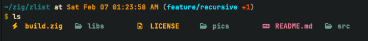
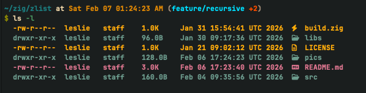
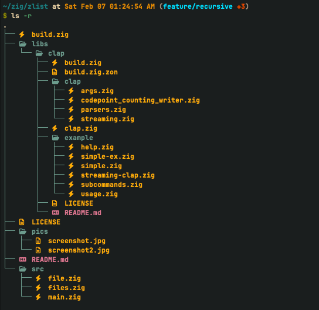

# zlist ⚡️

> A lightweight, modern alternative to `ls` built with **Zig**.

[](https://github.com/here-Leslie-Lau/zlist)
[](https://ziglang.org/)
[](LICENSE)

**zlist** isn't just another file lister. It's designed to be fast, minimal, and visually pleasing right out of the box. No complex configurations—just compile and go.

## ✨ Why zlist?

*   **Blazing Fast**: Written in Zig, it starts up instantly and creates zero garbage.
*   **Visual Context**:
    *   **Nerd Fonts** support included by default.
    *   File-type specific icons for `Zig`, `Rust`, `Go`, `Python`, `JS/TS`, `C/C++`, and more.
    *   Special highlighting for directories (Blue) and Markdown files (Magenta).
*   **Smart Details**: All the info you need (`permissions`, `user`, `group`, `size`, `time`) formatted for humans, not machines.
*   **Unique Sorting**: Sort by filename or **filename length** (because sometimes short names are harder to find).

## 📸 Preview





*(Make sure you have a [Nerd Font](https://www.nerdfonts.com/) installed in your terminal to see the icons!)*

## 🚀 Installation

### Precompiled Binaries

*TODO, coming soon!*

### From Source

Requirements: `zig` (master/0.16.0-dev recommended).

```bash
# 1. Clone the repo
git clone --recursive https://github.com/here-Leslie-Lau/zlist.git
cd zlist

# 2. Build in release mode [ReleaseFast, ReleaseSafe, ReleaseSmall]
zig build -Doptimize=ReleaseFast

# 3. Run it. (Optional: add to PATH, it's up to you.)
./zig-out/bin/ls
```

## 🛠 Usage

Simple and intuitive.

```bash
ls [OPTIONS] [PATH]
```

| Flag | Description |
| :--- | :--- |
| `-l`, `--long` | Enable detailed view (permissions, size, date, user). |
| `-a`, `--a` | Show hidden files (starting with `.`). |
| `-s`, `--sort <mode>` | **0**: Name (A-Z) [Default]<br>**1**: Name Length (Shortest first) |
| `-r`, `--recursive` | Recursively list subdirectories encountered. |
| `-h`, `--help` | Print help message. |

### Examples

**Standard list:**
```bash
ls
```

**Show everything with details:**
```bash
ls -la
```

**Find short filenames easily (Sort by length):**
```bash
ls -s 1
```

**Dig deep (Recursive listing):**
```bash
ls -r
```

## 🛣 Roadmap

*   [x] Basic file listing & recursion
*   [x] Color output & Nerd Font icons
*   [x] Detailed file stats
*   [x] Sorting by name length
*   [x] Recursive directory traversal (`-r`)

## 🤝 Contributing

Got an idea? Found a bug? Feel free to open an issue or drop a PR. This is a fun side project, and all contributions are welcome.

1.  Fork it
2.  Create your feature branch (`git checkout -b feature/cool-thing`)
3.  Commit your changes
4.  Push to the branch
5.  Open a Pull Request

---

*Crafted with ❤️ in Zig.*
