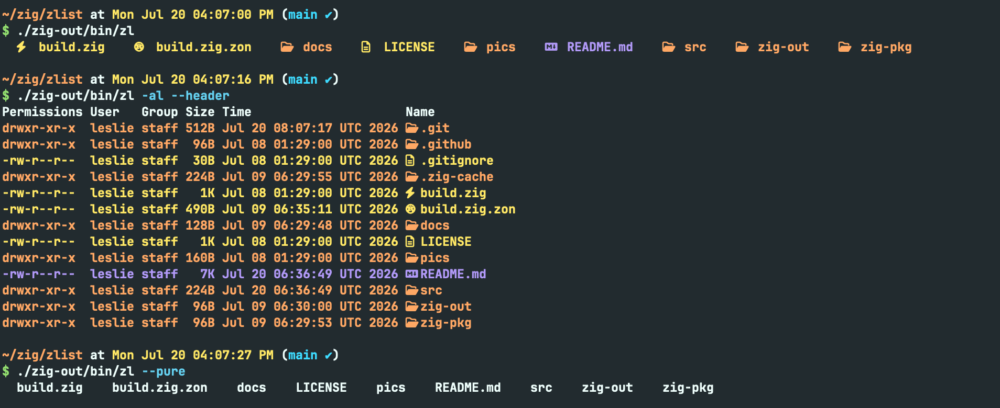
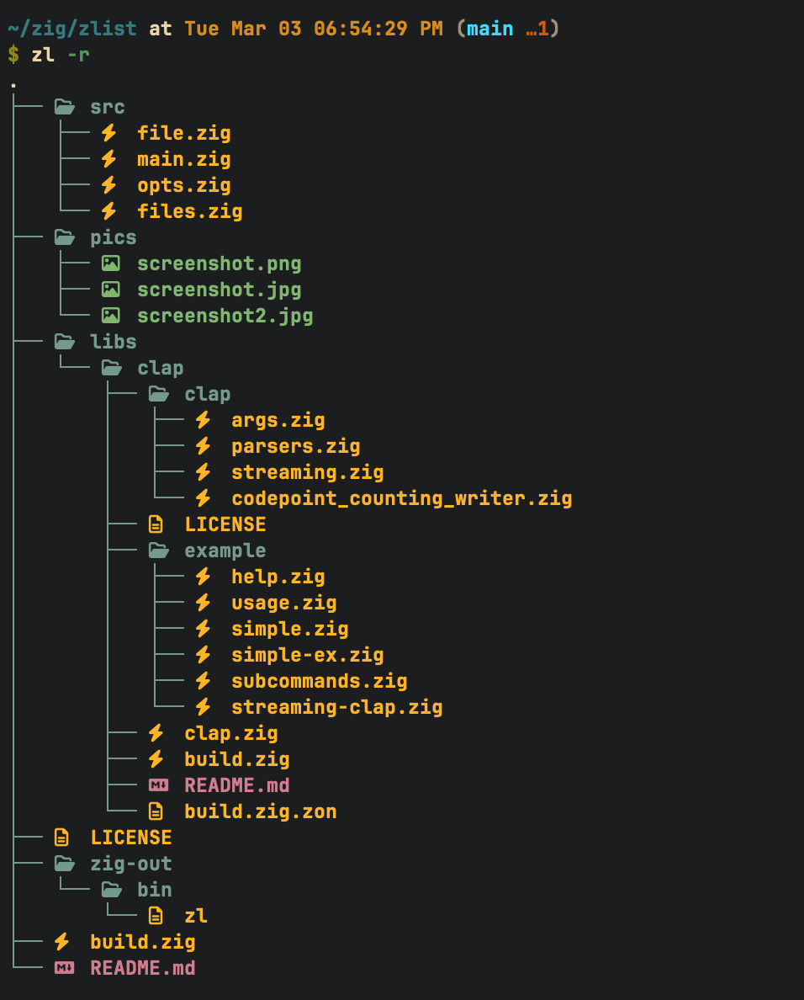
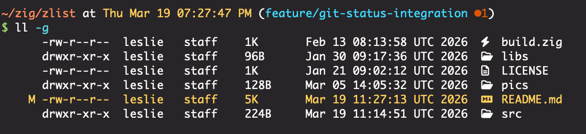

# zlist ⚡️

> A modern, colorful alternative to `ls` built with **Zig**.

[](https://github.com/here-Leslie-Lau/zlist)
[](https://ziglang.org/)
[](LICENSE)

**Note**: This is my **first CLI tool in Zig**! 🚀

I built this project to learn Zig, get comfortable with manual memory management, and explore the standard library. It might not be the fastest or smallest `ls` clone (yet), but it's usable today and still getting better.

## Table of Contents

- [Features](#features)
- [Preview](#preview)
- [Installation](#installation)
- [Usage](#usage)
- [Use as a Zig Module](#module)
- [Benchmark](#benchmark)
- [Roadmap](#roadmap)
- [Contributing](#contributing)

<a id="features"></a>
## ✨ Features

Already pretty capable for a learning project:

*   **Compact grid layout** that stays easy to scan.
*   **Color and Nerd Font icons** for common file types and languages.
*   **Readable long view** with permissions, owner, size, and timestamps.
*   **Optional recursive directory size** in long view and size sorting.
*   **Multiple sort modes** including name, length, directories first, mtime, and size.
*   **Recursive listing** with optional depth limits.
*   **Useful filters** for files, directories, extensions, names, size, and modified time.
*   **Quick summary report** for file and folder counts.
*   **Git status indicators** in long view.

<a id="preview"></a>
## 📸 Preview





*(Make sure you have a [Nerd Font](https://www.nerdfonts.com/) installed in your terminal to see the icons!)*

<a id="installation"></a>
## 🚀 Installation

### macOS

Install with Homebrew:

```bash
brew tap here-leslie-lau/tap
# Maybe need trust
brew install zlist
```

### Precompiled Binaries

Download the latest binary for your system from the [Releases](https://github.com/here-Leslie-Lau/zlist/releases) page.

> **Note**: Windows is currently **not supported** due to differences in file system APIs. Support may be added in future versions.

### From Source

Requirements: `zig` (master/0.17.0-dev recommended).

```bash
# 1. Clone the repo
git clone git@github.com:here-Leslie-Lau/zlist.git
cd zlist

# 2. Build in release mode [ReleaseFast, ReleaseSafe, ReleaseSmall]
zig build -Doptimize=ReleaseFast

# 3. Run it. (Optional: add to PATH, it's up to you.)
./zig-out/bin/zl
```

<a id="usage"></a>
## 🛠 Usage

Just run:

```bash
zl [OPTIONS] [PATH]
```

```bash
$ zl --help
    -h, --help
            Usage: zl [OPTIONS] [PATH]...

    -l, --long
            Show the long view.

        --no-permissions
            Hide permissions from the long view.

        --no-user
            Hide user from the long view.

        --no-group
            Hide group from the long view.

        --no-size
            Hide size from the long view.

        --no-time
            Hide time from the long view.

        --no-icon
            Hide icon from the long view.

    -a, --a
            Include hidden entries.

        --du
            Show recursive directory size in long view and size sort. This is the sum of file sizes, not the same as `du` disk usage.

        --dir-grouping <DIRGROUPING>
            Group directories before or after files. Default: none. OPTIONS: none, before, after.

    -s, --sort <SORTTYPE>
            Sort results. Default: name. OPTIONS: name, length, mtime, size.

        --reverse
            Reverse sort.

        --size <str>...
            Filter files by size range (e.g. --size gt:10K --size lte:2M).

        --changed-within <str>
            Only show entries changed within a time range (e.g. --changed-within 7d).

    -r, --recursive
            Recurse into subdirectories. Same as -L 0.

    -L, --level <INT>
            Limit recursion depth. 0 means no limit.

    -p, --pure
            Show names only, without colors or icons.

    -R, --report
            Show a short summary of files and folders.

    -d, --dir
            Only show directories. If used with -D, both are ignored.

    -D, --no_dir
            Only show files. If used with -d, both are ignored.

    -g, --git
            Show git status in long view.

    -e, --ext <str>...
            Filter by extension (e.g. --ext zig,md,ts).

    -m, --match <str>...
            Filter names by substring (e.g. --match main,readme).

    <str>...
```

For common commands examples, see [zlist examples](docs/examples.md).

<a id="module"></a>
## Use as a Zig Module

`zlist` can also be used from another Zig project when you want the listing data without the CLI output.

Add it with Zig's package manager:

```bash
zig fetch --save git+https://github.com/here-Leslie-Lau/zlist
```

Then expose the module in your `build.zig`:

```zig
const zlist_dep = b.dependency("zlist", .{
    .target = target,
    .optimize = optimize,
});

exe.root_module.addImport("zlist", zlist_dep.module("zlist"));
```

Use it from code:

```zig
const std = @import("std");
const zlist = @import("zlist");

fn printNames(allocator: std.mem.Allocator, io: std.Io, dir: std.Io.Dir) !void {
    var files = try zlist.Files.init(allocator, io, dir, .{ .path = "." });
    defer files.deinit();

    for (files.entries()) |entry| {
        std.debug.print("{s}\n", .{entry.name});
    }
}
```

For options, ownership rules, and more examples, see [Using zlist as a module](docs/using-as-a-module.md).

<a id="benchmark"></a>
## Benchmark

Benchmarked with `hyperfine` on macOS with an Apple M4 CPU.

With icons and colors:

| Tool | n=50 | n=500 | n=5000 | n=50000 |
| :--- | :--- | :--- | :--- | :--- |
| `zl` | `696.4 µs ±  59.4 µs` | `957.2 µs ±  62.2 µs` | `4.4 ms ±   0.1 ms` | `45.9 ms ±   2.1 ms` |
| `eza` | `3.0 ms ±   0.2 ms` | `2.8 ms ±   0.2 ms` | `2.9 ms ±   0.1 ms` | `3.1 ms ±   0.2 ms` |
| `lsd` | `2.9 ms ±   0.1 ms` | `10.7 ms ±   0.6 ms` | `97.8 ms ±   2.1 ms` | `1.227 s ±  0.055 s` |

`eza` is the weirdly steady one here: its wall time barely moves whether the directory has 50 files or 50K. Its system CPU time also stays under 2 ms even at 50K entries. `zl` is already quick at smaller sizes, but this is exactly the kind of scaling behavior it should learn from next.

*Benchmark results may vary depending on filesystem and hardware.*

<a id="roadmap"></a>
## 🛣 Roadmap

*   [x] Basic file listing & recursion
*   [x] Color output & Nerd Font icons
*   [x] Detailed file stats
*   [x] Sorting by name (default), length, and modification time
*   [x] Recursive directory traversal (`-r`)
*   [x] Depth control for recursion (`-L`)
*   [x] Clean output mode (`-p`)
*   [x] Filter by files or directories (`-d`, `-D`)
*   [x] Extension filter (`-e`, `--ext`)
*   [x] Name match filter (`-m`, `--match`)
*   [x] Smart dynamic grid layout
*   [x] Summary report (`-R`)
*   [x] Git status integration (`-g`)
*   [x] Recursive directory size (`--du`)
*   [x] Lib API for embedding in other Zig projects
*   [ ] Multi-threading for faster `stat` calls
*   [ ] Custom color/icon configurations (Maybe, if you need it)

<a id="contributing"></a>
## 🤝 Contributing

Got an idea? Found a bug? Open an issue or send a PR. This is a fun side project, and contributions are always welcome.

1.  Fork it
2.  Create your feature branch (`git checkout -b feature/cool-thing`)
3.  Commit your changes
4.  Push to the branch
5.  Open a Pull Request

---

*Crafted with ❤️ in Zig.*
